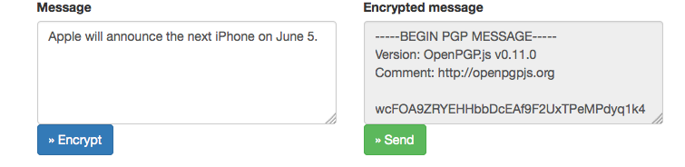

encrypted secret letterbox
=================

Simple *proove of concept* box for secret messages. The message is encrypted on the client using the pgp public key, submitted and saved on the server. The plaintext message is never sent over the network. Only the owner of the pgp private key can read the messages. The Web-Application can be used offline and the messages can be synced later.

Created for PHP 5.3+, using [Slim](http://www.slimframework.com/), [AngularJS](https://angularjs.org/) and [OpenPGP JS][1]. The system is as simple as possible. There is also a rsync-script to download and delete the encrypted messages from the server. 

To install, you should read through the script, understand them and change the PGP in `public_key.js`. 

## Disclaimer
You should update to the latest version of  [OpenPGP JS][1]. I can not validate the security of [OpenPGP JS][1], therefore I can not recommend it for production use. 

There is no spam protection nor any valiation. 

[1]: https://github.com/openpgpjs/openpgpjs

## Key creation

gpg --gen-key
gpg --armor --export  "demokey" > public_key.txt

## Development
Clone repo and run php webserver:

    php -S localhost:8000

